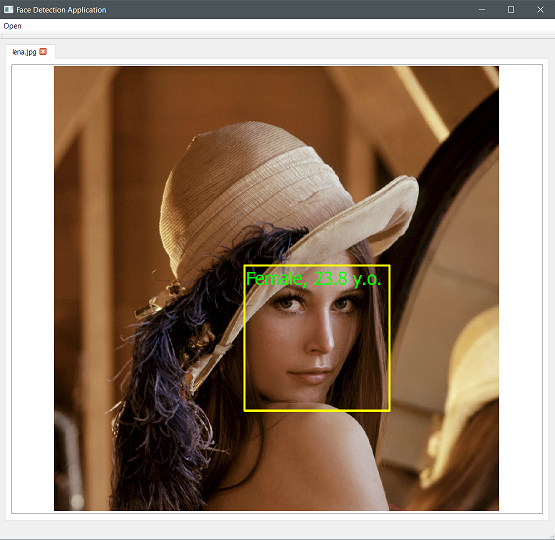

# Face Detection CLI and GUI applications

In this repository you will find two applications with Command Line and Graphical User Interfaces for detecting people's faces on images. Both applications use the same library located in `FaceDetectionLIB` directory.

## CLI

### Description
CLI application requires path to images to be passed as command line arguments. As a result, this application will print a JSON document that contains information about faces it found on each image. Nonexisting files are ignored and will not be present in the output JSON document.

### Output example

```bash
./FaceDetectionCLI non_existing_file.bmp image_with_no_faces.jpeg lena.jpg 
```
```json
{
    "image_with_no_faces.jpeg": [
    ],
    "lena.jpg": [
        {
            "age": {
                "mean": 23.7863,
                "variance": 51.5524
            },
            "coordinates": {
                "height": 334,
                "width": 334,
                "x": 438,
                "y": 459
            },
            "gender": "female"
        }
    ]
}
```

### Building and Running

```bash
mkdir FaceDetectionCLI/build && cd FaceDetectionCLI/build
cmake ..
cmake --build .
./FaceDetectionCLI <path to image file> [<path to image file> [<path to image file> [...]]]
```

## GUI

### Description

GUI application allows users to select image files (in JPEG or BMP formats) or directories (in which case it will be searched nonrecursively with all it's JPEG and BMP files selected) via file dialog.  
After images are selected, they will be displayed (each in it's own tab) in the main window with 'Processing...' annotation at the center of each image; progress bar will appear at the bottom of main window. You can use mouse wheel to zoom currently selected image in and out.  
When image is processed, 'Processing...' annotation is removed and information about each face is displayed. When all images have been processed, progress bar will dissappear.

### Screenshot


### Building and Running

```bash
mkdir FaceDetectionGUI/build && cd FaceDetectionGUI/build
cmake ..
cmake --build .
./FaceDetectionGUI
```

## Docker

You can build both applications on Linux using Docker with the following commands:

```bash
docker build --tag=facedetectionappsbuilder .
docker run -v `pwd`:/mnt facedetectionappsbuilder:latest
```

`FaceDetectionCLI-0.1.1-Linux.deb` and `FaceDetectionGUI-0.1.1-Linux.deb` should appear in repository's root directory.

You can install these packages onto your machine by executing

```bash
apt install ./FaceDetectionCLI-0.1.1-Linux.deb
apt install ./FaceDetectionGUI-0.1.1-Linux.deb
```
**KNOWN ISSUE:** only one of the above packages can be installed at any time due to their dependency on libFaceDetectionLib.so. If you want to delete currently installed package, use `apt remove facedetectioncli` or `apt remove facedetectiongui`
